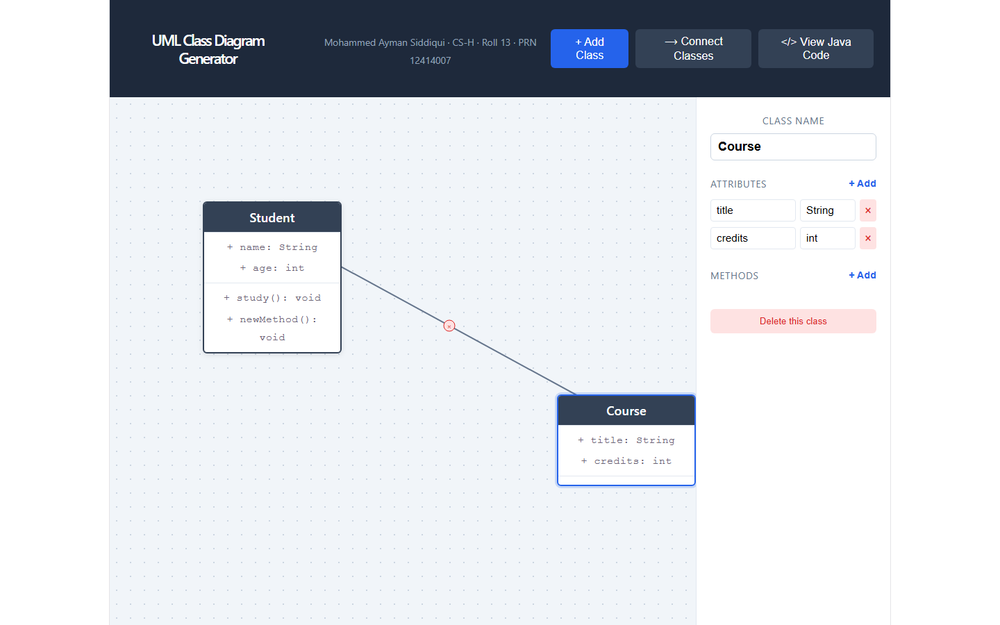
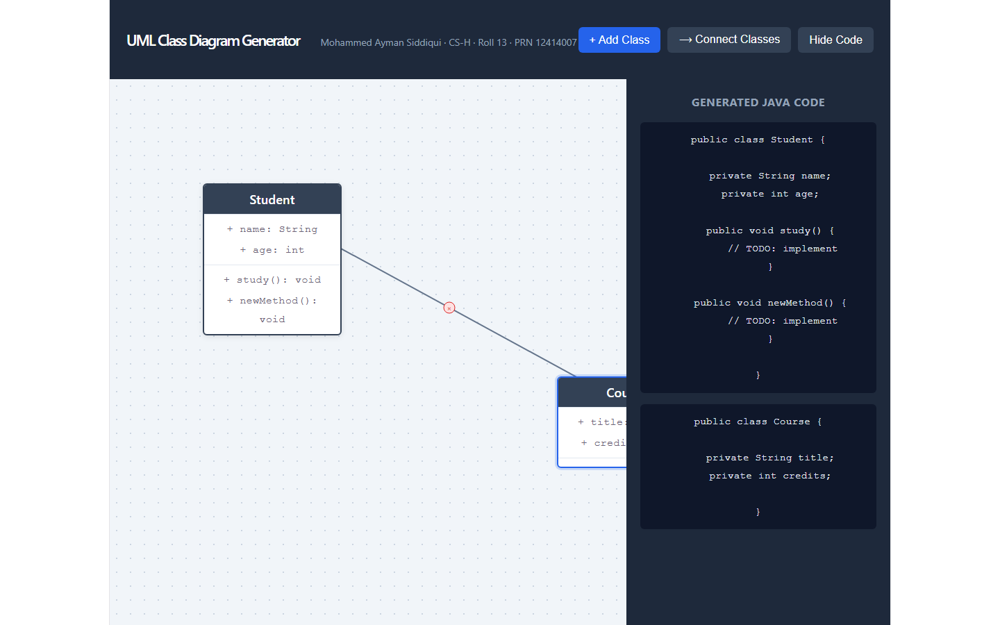

# UML Class Diagram Generator

An interactive, browser-based tool for visually designing UML class diagrams and generating corresponding Java source code in real time.

## Features
- Drag-and-drop class boxes on a canvas
- Live editing of class name, attributes, and methods via a side inspector
- Draw relationship lines (association/inheritance) between classes
- Delete classes and relationships
- Real-time Java code generation reflecting the current diagram

## Tech Stack
- React 19 (Vite)
- SVG for relationship line rendering
- Native mouse events for drag-and-drop (no external DnD library)

## How to Use
1. Click "+ Add Class" to create a new class box
2. Click a class to select it and edit its name/attributes/methods in the side panel
3. Click "Connect Classes," then click two classes in sequence to draw a relationship
4. Click "View Java Code" to see generated Java for all classes

## Design Notes
- Drag state is managed via `useRef` and `window`-level mouse listeners for smooth, uninterrupted dragging
- Class and relationship data are held in React state at the App level (single source of truth)
- Java generation is a pure function that reads live class data and relationships, producing valid Java syntax including inheritance (`extends`)

## Setup
```bash
npm install
npm run dev
```

## Screenshots





